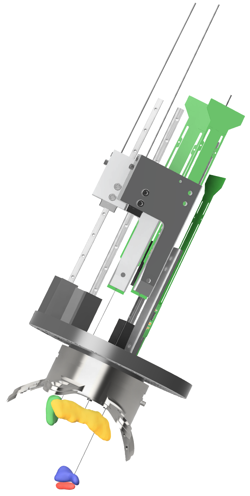
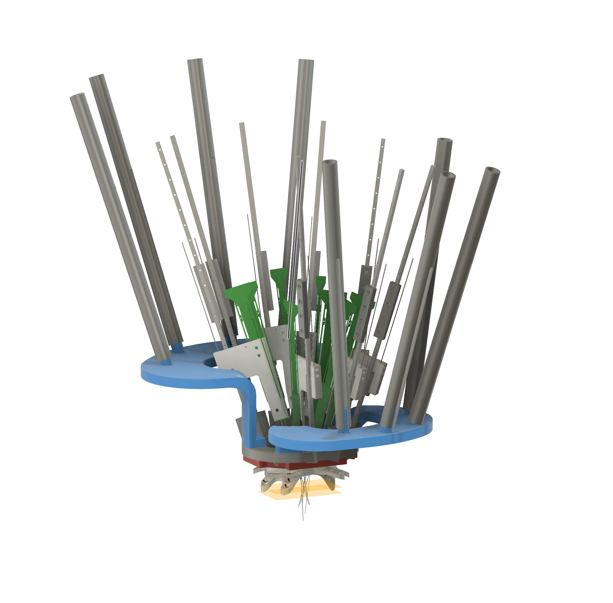
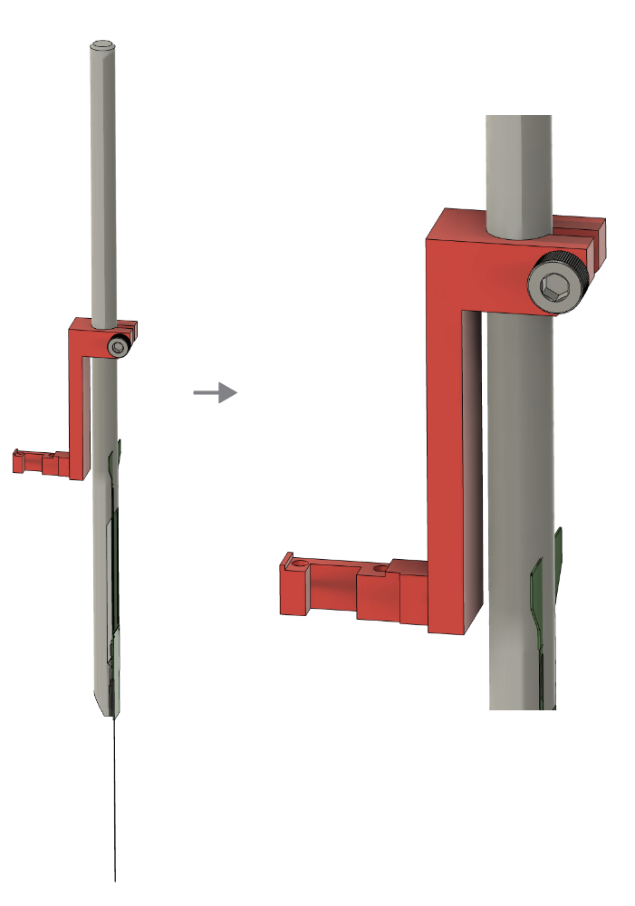

# Neuropixels-NHP-hardware

This repository and the associated wiki contain a collection of open-source hardware designs and documentation of methods for using silicon probes like the Neuropixels-NHP in nonhuman primates (NHP) and other large animal models. The experience documented here is currently focused on acute recordings, and information regarding semi-chronic recordings will be added once this testing is complete. We welcome pull requests for additional designs and information from the community. 

Using silicon probes in NHP involves a different set of design constraints from single electrodes or wire-based linear arrays (e.g.: S-probes, V-probes). In particular the probe shank is typically shorter (currently 45mm and 25mm for the two variants of Neuropixels NHP), and the mechanical properties of silicon are different from tungsten or stainless steel. Commercially-available electrode drive systems (such as Narishige, NaN, Thomas, FHC, Alpha Omega, etc.) are designed for inserting long, metal-based electrodes. Using these drives with silicon arrays like the Neuropixels NHP requires mechanical adapters, and careful consideration of the insertion mechanics. 

This repository contains:
1. CAD models, 3D models, and drawings for mechanical adapters for the Neuropixels-NHP probe for a variety of commercially available drives.
2. [Neuropixels NHP wiki](https://github.com/etrautmann/Neuropixels-NHP-hardware/wiki) - describing design constraints and considerations for different experimental use cases. 
3. Additional CAD models for the Neuropixels probe, rhesus brain model, etc. 

Most documentation of use cases and insertion protocols live on the wiki. 

---
# Examples

## 3x probes in M1, SMA, and GPi

Example hardware for inserting three probes simultaneously, targeting Supplemental motor area, GPi in the basal ganglia, and primary motor cortex (M1). In this example, all probes are inserted along a trajectory parallel to the chamber axis.

---
## 8x probes in motor cortex

This example illustrates hareware for inserting eight probes into a single superficial region (max depth ~9mm). Note, not all features are visible, such as headstages and the connections between electrode drive and the linear rail insertion assembly. This example illustrates insertion along an axis which is not parallel to chamber axis. 

---

## Insertion to deep targets

# Example 1
This example illustrates insertion to deep targets using a standard 19 mm Christ chamber, where the insertion trajectory is not aligned with the chamber axis.

<!--  -->

# Example 2

An alternative approach for insertion to deep targets, using nested dovetail rails to maintain alignment between the probe and guide tube.

 

---
## Adapter - Narishige to dovetail rod

IMEC sells 1/4" dovetail rods, which provide a convenient interface for holding probes, and can be adapted easily to different drives. These dovetail rods allow for convenient coarse positioning, but it should be noted that the neuropixels shank is not aligned with the center of the rod. A model of the drive is not available, but this configuration has been tested and works.

<!--  -->

